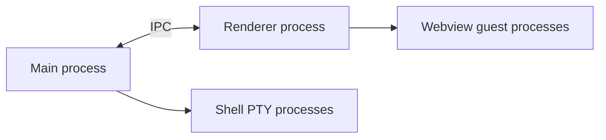
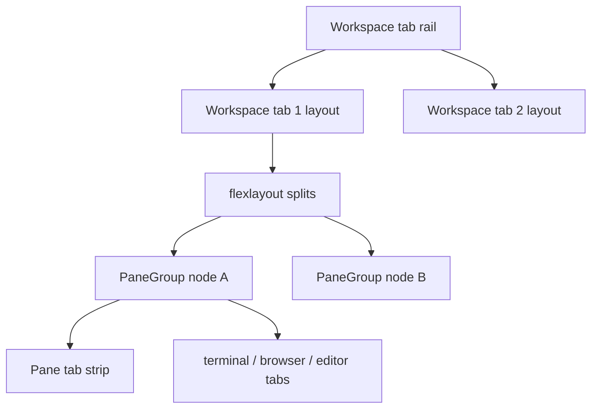

# Overview

Workspace is an Electron desktop app that combines **terminal**, **browser**, and **editors** in a multi-tab, multi-split layout—similar to an IDE with embedded browser panes.

## Process model



| Process | Responsibilities |
|---------|------------------|
| **Main** | Window, workspace JSON persistence, PTY spawn/resize, filesystem IPC, clipboard |
| **Renderer** | React UI, flexlayout, xterm.js, `<webview>` tags |
| **Guest** | One Chromium renderer per active `<webview>` (can be multiple per window) |
| **PTY** | User shell (bash/zsh) per terminal id |

The renderer never spawns shells directly. All PTY I/O goes through main via `pty:*` IPC.

## UI hierarchy (two tab levels)



1. **Workspace tab** — top-level rail entry; each has its own `root_path` and flexlayout JSON.
2. **flexlayout tab node** — one “pane” in the split grid; component type is always `tabgroup` (`PaneGroup`).
3. **Pane tab** — heterogeneous tabs inside a pane (terminal, browser, code, markdown).

## Visibility model

Both workspace tabs and pane tabs use **keep mounted, hide with CSS**:

| Level | Hidden mechanism | Why not `display: none` on embeds |
|-------|------------------|-------------------------------------|
| Workspace tab | `visibility: hidden`, `pointer-events: none`, z-index | `display: none` on workspace host was removed; webviews use `visibility: hidden` at pane level |
| Pane tab | `visibility: hidden`, `pointer-events: none` on content item | Chromium guests can blank/freeze when ancestors use `display: none` |

`InteractionCoordinator` applies **webview `pointer-events`** on top of CSS because Electron guests do not always respect ancestor `pointer-events`.

## State ownership (current)

| State | Owner | Notes |
|-------|-------|-------|
| Workspace tabs, active tab, layouts | Main `Workspace` + `workspace.json` | Broadcast via `workspace:updated` |
| flexlayout `Model` per workspace tab | Renderer `App.tsx` `modelsRef` | Debounced persist to main |
| Active pane tab within a group | Renderer `PaneGroup` `localActiveId` | Synced to model asynchronously |
| Terminal scrollback / output | Main `PtyReplayBuffer` | Renderer reconnects via `pty:connect` |
| Browser URL, zoom | flexlayout `PaneGroupConfig` on tab items | Persisted in layout JSON |
| Overlay / pointer / portals | `InteractionCoordinator` | Module singleton in renderer |

Phase 2 (planned) will move much of this into a Zustand workspace-scope store. See [07-future-phases.md](./07-future-phases.md).

## Build & run

```bash
cd apps/workspace
npm install
npm run dev    # development
npm run build  # production bundle → apps/workspace/out/
```

Typecheck: `npm run typecheck` (node + web TS projects).

## Related docs

- [02-process-and-ipc.md](./02-process-and-ipc.md)
- [03-workspace-and-layout.md](./03-workspace-and-layout.md)
- [04-interaction-coordinator.md](./04-interaction-coordinator.md)
