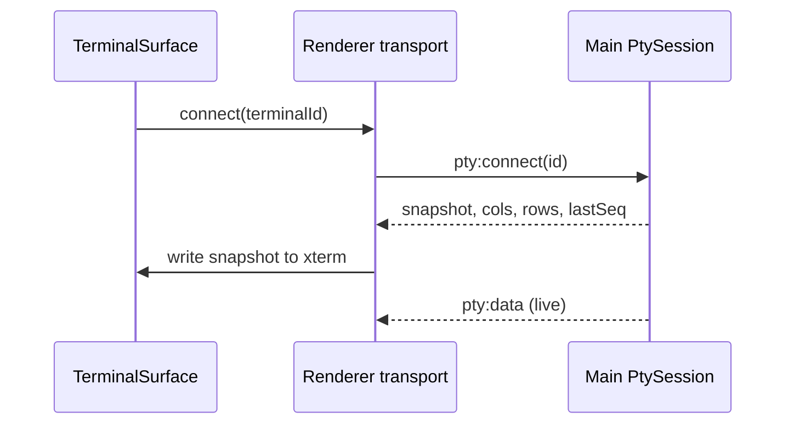

# Process & IPC

## Preload bridge

`apps/workspace/src/preload/index.ts` exposes a typed API on `window.electron` (see `apps/workspace/src/preload/index.d.ts`). Renderer code imports shims from `apps/workspace/src/renderer/src/electron.ts`.

Context isolation is enabled; renderer cannot import Node modules directly.

## Workspace IPC

| Channel | Direction | Purpose |
|---------|-----------|---------|
| `workspace:get-state` | invoke → | Initial hydrate |
| `workspace:updated` | main → renderer event | Push full state after any mutation |
| `workspace:add-tab` | invoke | New workspace tab |
| `workspace:close-tab` | invoke | Close tab by id |
| `workspace:select-tab` | invoke | Set `activeTabId` |
| `workspace:set-tab-layout` | invoke | Persist flexlayout JSON string |
| `workspace:set-tab-root-path` | invoke | Change tab root directory |

Main source: `apps/workspace/src/main/workspace.ts`, handlers in `apps/workspace/src/main/index.ts`.

`persist()` writes `workspace.json` and emits `workspace:updated` via `sendToMainWindow` (handles window recreation on macOS).

### Workspace state shape (conceptual)

```typescript
{
  tabs: Array<{
    id: number;
    title: string;
    root_path: string;
    layout_json: string;  // flexlayout IJsonModel serialized
  }>;
  activeTabId: number;
}
```

Renderer `useWorkspace()` maps snake_case fields (`active_tab_id`, `layout_json`, `root_path`).

## PTY IPC

| Channel | Direction | Purpose |
|---------|-----------|---------|
| `pty:spawn` | invoke | Create terminal id + shell |
| `pty:connect` | invoke | Attach renderer; returns replay snapshot |
| `pty:disconnect` | send | Detach renderer (PTY keeps running) |
| `pty:data` | main → renderer | `{ id, seq, data }` output chunk |
| `pty:write` | send | Input bytes to shell |
| `pty:resize` | send | SIGWINCH dimensions |
| `pty:dispose` | send | Kill session |

Main: `apps/workspace/src/main/ptySession.ts` — `PtySession` wraps `Pty`, maintains `PtyReplayBuffer` (~5000×120 char cap).

Renderer: `apps/workspace/src/renderer/src/terminal/ptyTransport.ts`, `connectPanePty.ts`.

### Connect / reconnect flow



When a workspace tab is hidden, renderer may call `pty:disconnect`; main keeps PTY alive. On show, `pty:connect` replays buffer.

## Filesystem IPC

Scoped per workspace tab id (`tabId` + relative path under tab `root_path`):

- `fs:list-dir`, `fs:read-file`, `fs:write-file`, `fs:create-dir`, `fs:delete-path`, `fs:rename-path`

Used by `TreeView` and editors.

## Browser-related IPC

| Channel | Purpose |
|---------|---------|
| `browser:open-new-tab` | `target=_blank` from guest → new pane browser tab |
| `browser:reload-shortcut` | Cmd+R routing from main |
| Guest focus relay | Tracks which webview has focus for shortcuts |

Registry: `apps/workspace/src/renderer/src/layout/activeBrowserWebview.ts`.

## Clipboard

- `clipboard:write-text` — OSC 52 paste from terminal
- Renderer `writeClipboardText` in `electron.ts`

## Error handling

Global renderer logging: `installGlobalErrorLogging()` → `ErrorLogPanel`.

Pane render errors: `PaneErrorBoundary` per flexlayout factory node.

## Related docs

- [05-terminal-pipeline.md](./05-terminal-pipeline.md)
- [06-browser-embeds.md](./06-browser-embeds.md)
