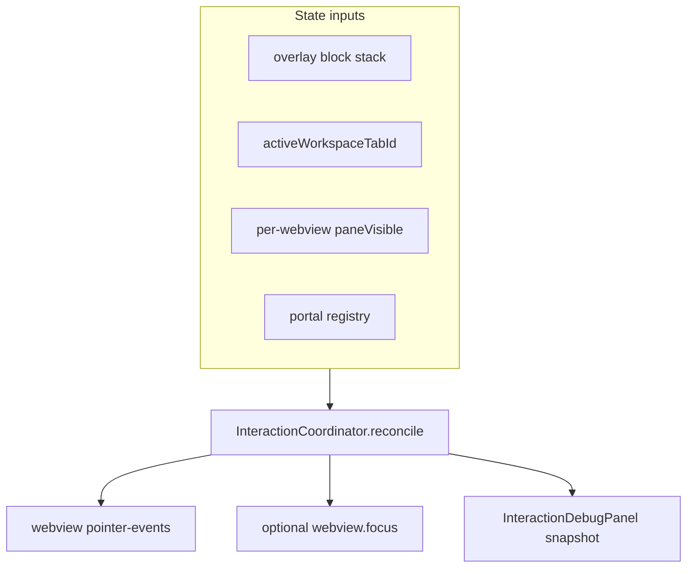

# Interaction coordinator

Phase 1 stability layer: a single module owns overlay blocking, embed pointer-events, portal lifecycle, and focus handoff.

**Source:** `apps/workspace/src/renderer/src/interaction/InteractionCoordinator.ts`  
**Policy:** `apps/workspace/src/renderer/src/interaction/webviewPolicy.ts` (unit-tested pure function)

**Singleton:** `interactionCoordinator`

## Problem it solves

Before centralization, multiple modules independently set `webview.style.pointerEvents`:

- `overlayBarrier` pushed `browserHideAll()` but **never restored** on pop (no subscribers to `subscribeOverlayBarrier`)
- `browserSyncPointerEvents` only ran on workspace tab switch
- `BrowserContent` set pointer-events per pane
- Orphan body portals blocked the entire app after workspace switch

Any missed restore path made the app feel “dead” until a coincidental tab switch.

## Architecture



Every input change calls `reconcile(reason)` which applies the full policy in one pass.

## Overlay block stack

Wrapped by `apps/workspace/src/renderer/src/browser/overlayBarrier.ts`:

```typescript
pushOverlayBlock(source)  // e.g. 'splitter-drag', 'add-tab-picker', 'pane-tab-strip-drag'
popOverlayBlock(source)
```

| Source | Trigger location |
|--------|------------------|
| `splitter-drag` | `App.tsx` pointer handlers on `.flexlayout__splitter` |
| `pane-tab-strip-drag` | `PaneTabStrip.tsx` flexlayout pane drag |
| `tab-chip-drag` | `tabDrag.ts` chip reorder / split drag |

Pane strip menus and pickers use **portal registry** only (no overlay block) so browsers stay visible behind popovers.

When `overlayStack.length > 0`, webviews are hidden (`display: none`) during drags.

**Safety net:** capture-phase `mouseup` clears stuck blocks (`overlay-mouseup-safety`) when WebKit misses `dragend` over a native webview.

When `portals.size > 0`, webviews stay visible but `pointer-events: none`.

## Webview display and pointer-events policy

Registered webviews (`registerWebview` / `unregisterWebview` from `BrowserContent`):

| Condition | `display` | `pointer-events` |
|-----------|-----------|------------------|
| Wrong workspace tab or `paneVisible === false` | `none` | `none` |
| Overlay blocked (splitter / pane / chip drag) | `none` | `none` |
| Portal open | `flex` | `none` |
| Active tab, pane visible, no block | `flex` | `auto` |

Unregistered webviews (fallback DOM query) follow the same rules.

`BrowserContent` sets `visibility` on the guest for inactive chips; coordinator owns `display` / `pointer-events`.

## Pane chip visibility

`interaction/embedPolicy.ts` — `paneChipContentStyle(paneVisible, chipActive)` in `PaneGroup`.

## Workspace tab activation

```typescript
interactionCoordinator.setActiveWorkspaceTab(tabId)
```

Called from:

- `WorkspaceTabRail.switchToTab` (optimistic, before IPC)
- `App.tsx` `useEffect([activeTabId])`

Moves focus off embeds before switching (`moveFocusFromEmbeds` → titlebar).

## Portal registry

```typescript
registerPortal(id, onDismiss) → unregister function
dismissAllPortals()
```

`dismissAllPortals` also removes legacy `.popover-catcher` nodes and dispatches `workspace:dismiss-portals` for components that still listen via `onWorkspaceDismissPortals`.

### Registered portals (current)

| Component | Registration |
|-----------|--------------|
| `Popover.tsx` | `useId()` on mount |
| `BrowserAddressBar.tsx` | suggestions dropdown when open |
| `TerminalSearch.tsx` | when search bar open |
| All `Popover` consumers | SettingsDialog, AppSettingsDialog, PanePicker, BrowserNavButton, SidebarQuickSwitchPopover, TextPrompt |

**Rule:** Any new `createPortal(..., document.body)` must register with the coordinator.

## Focus policy

- **Removed:** `BrowserContent` auto `webview.focus()` on every `visible` transition (stole focus from terminal/editor).
- **Added:** When pane becomes visible, coordinator focuses webview only if policy enables pointer-events on that guest.

## Debug panel

`apps/workspace/src/renderer/src/components/InteractionDebugPanel.tsx` — fixed bottom-right **IC** badge.

Shows: overlay count/sources, active workspace tab, webview count, portal ids, last reconcile reason.

If `overlayBlockCount > 0` stuck, badge highlights and offers **Clear overlay blocks**.

## Public API summary

| Method | Purpose |
|--------|---------|
| `pushOverlayBlock(source)` | Block embed interaction |
| `popOverlayBlock(source)` | Unblock + reconcile |
| `clearOverlayBlocks(reason?)` | Force clear stack |
| `isOverlayBlocked()` | Boolean |
| `setActiveWorkspaceTab(id)` | Workspace switch |
| `registerWebview(wv, { workspaceTabId, paneTabItemId })` | Track guest |
| `unregisterWebview(wv)` | Cleanup |
| `setBrowserPaneVisible(tabId, itemId, visible)` | Pane tab visibility |
| `registerPortal(id, dismiss)` | Portal lifecycle |
| `dismissAllPortals()` | Workspace switch / explicit dismiss |
| `getSnapshot()` | Debug state |
| `subscribe(listener)` | Debug panel updates |
| `reconcile(reason)` | Manual/full policy refresh |

## Adding a new overlay UI

1. `pushOverlayBlock('your-feature')` when overlay opens / drag starts
2. `popOverlayBlock('your-feature')` when it closes / drag ends
3. Do **not** call `browserHideAll()` directly
4. If using body portal, `registerPortal` or use `Popover`

## Related docs

- [03-workspace-and-layout.md](./03-workspace-and-layout.md)
- [06-browser-embeds.md](./06-browser-embeds.md)
- [07-future-phases.md](./07-future-phases.md)
