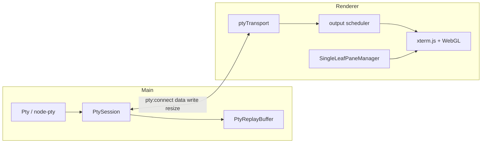

# Terminal pipeline

Terminal rendering follows an Orca-inspired **session vs mount** split: the shell PTY lives in main; xterm.js is a mount that can suspend without killing the session.

## Data flow



## Main process

| File | Role |
|------|------|
| `electron/src/main/pty.ts` | Low-level PTY spawn |
| `electron/src/main/ptySession.ts` | `PtySession`, `PtyReplayBuffer`, attach/detach |
| `electron/src/main/workspace.ts` | `TerminalEntry` map, spawn on layout restore |

`PtyReplayBuffer` retains ~5000×120 characters for reconnect replay. Output while disconnected is still buffered.

`pty:connect` returns:

```typescript
{
  id, snapshot, snapshotCols, snapshotRows, lastSeq, isReattach
}
```

## Renderer transport

| File | Role |
|------|------|
| `terminal/ptyTransport.ts` | IPC connect, seq-numbered output |
| `terminal/ptyInputWriteQueue.ts` | Batched input writes |
| `terminal/connectPanePty.ts` | Wires transport → scheduler → xterm; OSC 52; resize |

On connect: replay snapshot, `refitPaneTerminal`, `ptyResize`.

Resize: `pane-fit-resize-observer` + `setPaneFitListener` for PTY sync (not a duplicate ResizeObserver in connectPanePty).

## Pane manager (single-leaf subset)

Directory: `electron/src/renderer/src/lib/pane-manager/`

Orca’s full split/divider PaneManager was reduced to **one xterm per pane**:

| Module | Role |
|--------|------|
| `single-leaf-pane-manager.ts` | Public API: create pane, refit, suspend/resume |
| `pane-dom-creation.ts` | xterm + addons (fit, search, serialize, unicode11, weblinks) |
| `pane-lifecycle.ts` | `openTerminal`, initial fit RAF loop |
| `pane-terminal-refit.ts` | `refitPaneTerminal` — fit + WebGL rebuild on resize |
| `pane-webgl-renderer.ts` | WebGL attach/dispose, context loss |
| `pane-rendering-control.ts` | `safeFit`, suspend/resume |
| `pane-terminal-output-scheduler.ts` | Foreground output queue + backlog cap |
| `pane-fit-resize-observer.ts` | ResizeObserver on `xtermContainer` |

### WebGL / GPU

- `@xterm/addon-webgl` beta aligned with Orca; patches in `electron/patches/`
- `terminalGpuAcceleration: "auto"` in `TerminalSurface`
- On resize: `refitPaneTerminal` disposes and re-attaches WebGL to avoid tiny-canvas glitches
- On hide: `suspendPaneRendering` disposes WebGL; resume refits and re-attaches

### Visibility / suspend

`TerminalSurface.tsx`:

```typescript
visible && active  // from PaneGroup + pane tab active
```

When false: `manager.setRenderingSuspended(true)` — WebGL off, deferred attachment.

When true: resume, refit, `ptyResize`, `terminal.focus()`.

## UI components

| File | Role |
|------|------|
| `panes/TerminalPane.tsx` | Thin wrapper |
| `panes/TerminalSurface.tsx` | Host div, manager lifecycle, search, theme |
| `components/TerminalSearch.tsx` | xterm search addon UI |
| `terminalThemes.ts` | Ghostty/Tango xterm themes |

## Themes

`XTERM_THEMES` keyed by resolved app theme; subscribed via `subscribeThemeChange`.

## Search

Cmd+F when terminal focused → `TerminalSearch` bar (not body-portaled; registers portal for dismiss on workspace switch).

Safe find wrapper: `terminalSearchSafeFind.ts` — limits query size.

## xterm dependencies

Declared in `electron/package.json`:

- `@xterm/xterm`, `@xterm/addon-fit`, `@xterm/addon-search`, `@xterm/addon-serialize`
- `@xterm/addon-unicode11`, `@xterm/addon-web-links`, `@xterm/addon-webgl`, `@xterm/addon-ligatures`

Post-install: `electron/scripts/apply-xterm-patch.mjs`

## Debugging terminal display

| Symptom | Check |
|---------|-------|
| Blank gray pane, tiny glyph corner | WebGL wrong size — `refitPaneTerminal` path; resize window |
| No input | PTY connected? `pty:connect` errors in ErrorLogPanel |
| Wrong size after tab switch | `refitPaneTerminal` on resume; `ptyResize` after fit |
| Scroll/TUI broken after switch | Ensure not unmounting xterm on workspace switch |

## Related docs

- [02-process-and-ipc.md](./02-process-and-ipc.md)
- [04-interaction-coordinator.md](./04-interaction-coordinator.md)
- [07-future-phases.md](./07-future-phases.md) — cold-park planned
