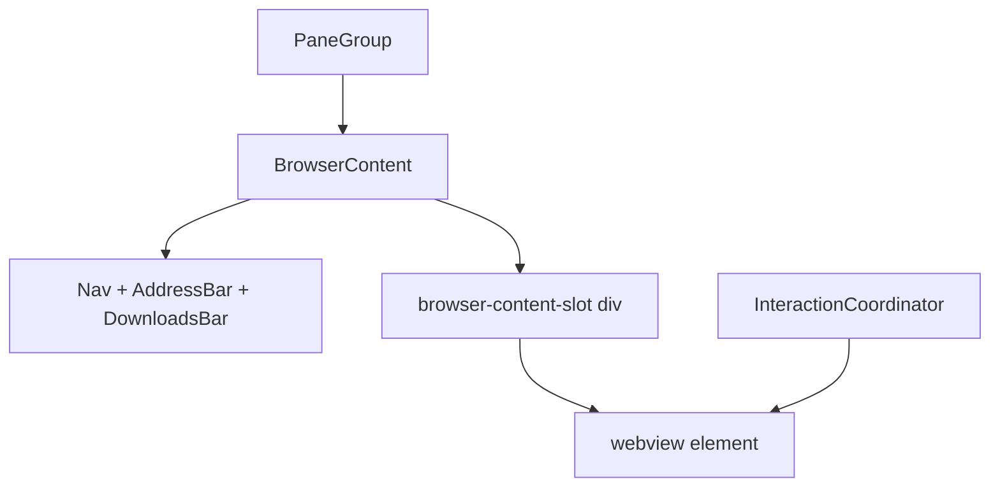

# Browser embeds

Browser panes use Electron **`<webview>`** guests (Chromium child processes), not iframes.

## Component structure



**Source:** `electron/src/renderer/src/panes/BrowserContent.tsx`

One webview per pane tab item (`item.id`), created imperatively in `useEffect` with empty deps (lifetime = tab item mount).

## Session partition

`BROWSER_SESSION_PARTITION` from `browserSessionPartition.ts` — shared session cookies across browser tabs in the app.

## Lifecycle

| Event | Behavior |
|-------|----------|
| Mount | `createElement('webview')`, register in `activeBrowserWebview`, `interactionCoordinator.registerWebview` |
| Navigate | `did-navigate`, `did-navigate-in-page` → update `item.url` in layout JSON |
| Visible | `visibility` on webview; `setBrowserPaneVisible` for pointer-events |
| Unmount | Remove DOM node, unregister webview, `pty:disconnect` N/A |
| `target=_blank` | Main denies window → `browser:open-new-tab` IPC → new pane browser tab |

## Pointer-events and visibility

**Pane chip slots** (`embedPolicy.ts` + `PaneGroup`): `visibility` / `pointerEvents` from `paneVisible && chipActive`.

**Webview guest** (`BrowserContent`):

```typescript
webview.style.visibility = visible ? "visible" : "hidden";
```

**Display + pointer-events** (`InteractionCoordinator` via `setBrowserPaneVisible`):

- Do not set `pointer-events` or `display` directly in `BrowserContent` except initial mount hide
- `setBrowserPaneVisible(workspaceTabId, item.id, visible)` where `visible` is chip-shown from embed policy
- Drag overlays: `display:none`; portals: `pointer-events:none` only

Inactive workspace tabs: coordinator hides their webviews (`display: none`).

## Focus tracking

| Mechanism | File |
|-----------|------|
| Guest focus → active webview | `layout/activeBrowserWebview.ts` |
| Cmd+R reload target | `getActiveBrowserWebview()` |
| Guest focus IPC relay | `installBrowserGuestFocusRelay` in App |
| Clear on non-browser focus | `installBrowserFocusTracking` |

Coordinator moves focus off webview before workspace tab hide; does not auto-focus on every show (avoids stealing terminal/editor focus).

## Chrome UI

| Component | Role |
|-----------|------|
| `BrowserNavButton` | Back/forward + history popover |
| `BrowserAddressBar` | URL input + portaled suggestions |
| `BrowserDownloadsBar` | Download progress per webContentsId |

Address bar suggestions register as coordinator portal when open.

## Navigation helpers

| Module | Role |
|--------|------|
| `browserUrl.ts` | URL normalization, blank page |
| `browserHistory.ts` | Local visit history for autocomplete |
| `browserNavHistory.ts` | Per-webview back/forward state |
| `browserSwipeNavPolicy.ts` | Trackpad horizontal swipe → goBack/goForward (main `input-event`) |
| `browserDownloads.ts` | Download events relay |

## Why not `display: none` on webview ancestors

Chromium can suspend or blank guest compositing when an ancestor uses `display: none`. Pane-level content uses `visibility: hidden` only (`PaneGroup.tsx` comment).

Workspace tab hosts also avoid `display: none` (use visibility + z-index). See [03-workspace-and-layout.md](./03-workspace-and-layout.md).

## Memory note

Every workspace tab with browser panes keeps live webviews while mounted. Multiple workspace tabs × multiple browser tabs = multiple guest processes.

Phase 3 plans a **WebviewRegistry** with LRU retention. See [07-future-phases.md](./07-future-phases.md).

## Debugging browser interaction

| Symptom | Check |
|---------|-------|
| Clicks do nothing after splitter drag | IC panel: `overlayBlockCount` should be 0 |
| Clicks work only after workspace switch | Overlay pop without reconcile (should be fixed) |
| Blank page after tab switch | Guest suspended — avoid `display: none` on hosts |
| Cmd+R wrong target | `getActiveBrowserWebview()` stale — focus tracking |

## Related docs

- [04-interaction-coordinator.md](./04-interaction-coordinator.md)
- [03-workspace-and-layout.md](./03-workspace-and-layout.md)
