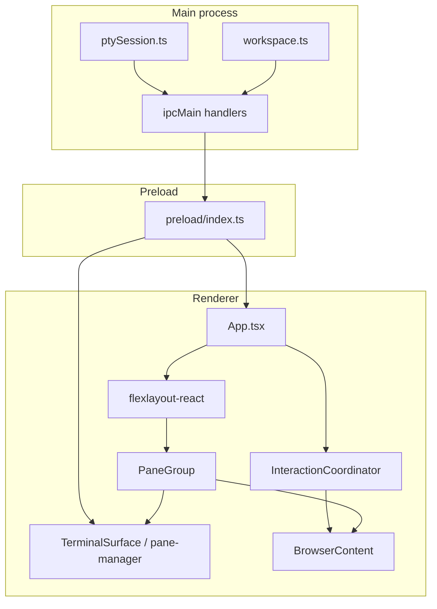

# Architecture

This folder documents how the Workspace Electron app is structured, why key decisions were made, and where to change behavior safely.

## Reading order

1. [01-overview.md](./01-overview.md) — big picture
2. [02-process-and-ipc.md](./02-process-and-ipc.md) — main process, preload, IPC channels
3. [03-workspace-and-layout.md](./03-workspace-and-layout.md) — workspace tabs, flexlayout, pane tabs
4. [04-interaction-coordinator.md](./04-interaction-coordinator.md) — **interaction stability** (Phase 1)
5. [05-terminal-pipeline.md](./05-terminal-pipeline.md) — terminal stack
6. [06-browser-embeds.md](./06-browser-embeds.md) — `<webview>` guests
7. [07-future-phases.md](./07-future-phases.md) — Phase 2–4 roadmap
8. [09-future-native-architecture.md](./09-future-native-architecture.md) — long-term direction (Rust core, native-process panes) — reference only, not designed yet

## Layer diagram

## Core principles

| Principle | What it means in this app |
|-----------|---------------------------|
| **Session ≠ mount** | PTY processes and layout JSON survive UI hide; React/xterm/webview are mount records that can suspend without killing session state. |
| **Hide, don’t unmount (workspace tab)** | All workspace tabs’ flexlayout trees stay mounted; switching is CSS visibility + coordinator policy, not destroy/recreate. |
| **Hide, don’t unmount (pane tab)** | Within a pane, terminal/browser/editor tabs stay mounted; inactive tabs use `visibility: hidden`. |
| **Single reconcile for interaction** | Overlay blocks, active workspace tab, and embed pointer-events are updated together via `InteractionCoordinator.reconcile()`. |
| **Portal registry** | Body-portaled UI registers dismiss handlers so workspace switches cannot leave invisible click-catchers. |

## Key source directories

| Path | Role |
|------|------|
| `electron/src/main/` | Node/Electron main: workspace state, PTY, IPC |
| `electron/src/preload/` | Context bridge (`window.electron`) |
| `electron/src/renderer/src/` | React UI |
| `electron/src/renderer/src/interaction/` | InteractionCoordinator |
| `electron/src/renderer/src/layout/` | flexlayout helpers, drag, active webview |
| `electron/src/renderer/src/lib/pane-manager/` | Single-leaf xterm + WebGL pipeline |
| `electron/src/renderer/src/panes/` | PaneGroup, BrowserContent, TerminalSurface |
| `electron/src/renderer/src/terminal/` | Renderer PTY transport |

## Debugging interaction issues

1. Open the **IC** badge (bottom-right, above error log).
2. Check `overlayBlockCount` — must be `0` when UI should accept clicks.
3. Check `lastReconcileReason` for the last policy application.
4. See [04-interaction-coordinator.md](./04-interaction-coordinator.md) for the full policy table.
