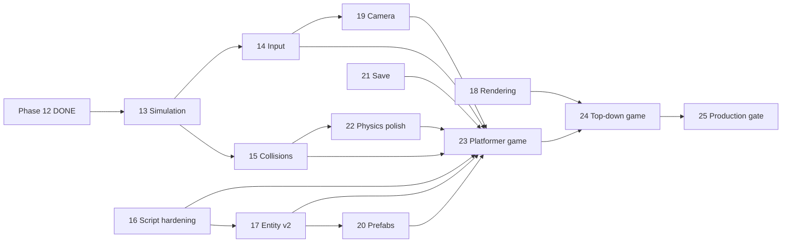

# World Engine — Phase Plan (Production Track)

**Status:** Active planning (2026-09-01)  
**목표:** 인디 게임 1작을 **엔진 포크 없이** 프로젝트 폴더만으로 완성할 수 있는 수준  
**구현:** `native/world-engine-core/` · `native/world-engine-qt-shell/`  
**관련:** [world-engine-project.md](./world-engine-project.md) (프로젝트 레이아웃) · [09-future-native-architecture.md](../architecture/09-future-native-architecture.md) (Workspace 통합 이력)

---

## 1. North Star

| 기준 | 의미 |
|------|------|
| **코드 SDK 우선** | Rust `Behavior` + `World::spawn*`가 진실의 원천. JSON/Rhai는 그 위 레이어 |
| **프로젝트 격리** | 게임 로직·에셋·씬은 `my-game/` 폴더. Workspace/Electron·엔진 바이너리에 도메인 코드 없음 |
| **깨져도 크래시 안 함** | 잘못된 JSON·스크립트·메시 참조는 경고 + 스킵 (기존 Phase 1–9 패턴 유지) |
| **매 Phase마다 falsifiable** | headless 테스트 또는 fixture 1개 + 수동 QA 체크리스트 |
| **API 안정성** | Phase 13부터 `world-engine.json` 스키마·Rhai 내장 함수는 **additive only** (breaking은 major 버전) |

**비목표 (이 트랙에서):** GDScript 수준 IDE, AAA 그래픽, 멀티플레이, Blender 대체.

---

## 2. 아키텍처 레이어 (고정)

이 순서와 책임 분리는 Phase가 늘어도 **바꾸지 않는다**.

```
┌─────────────────────────────────────────────────────────────┐
│  Shell (world-engine-qt-shell / future embed)               │
│  창, 입력 포워딩, CLI, 프로젝트 경로                           │
└───────────────────────────┬─────────────────────────────────┘
                            │ native handle, on_input
┌───────────────────────────▼─────────────────────────────────┐
│  Render (world-engine-core::render)                           │
│  wgpu, mesh upload, camera, draw_list                         │
└───────────────────────────┬─────────────────────────────────┘
                            │ Transform, MeshKind
┌───────────────────────────▼─────────────────────────────────┐
│  Simulation (world-engine-core::world)                        │
│  ECS(hecs), rapier3d, step loop, Behavior SDK                 │
└───────────────────────────┬─────────────────────────────────┘
                            │ spawn / attach_script / events
┌───────────────────────────▼─────────────────────────────────┐
│  Data (world-engine-core::scene + project/)                   │
│  world-engine.json, prefabs, Rhai, glTF assets                │
└─────────────────────────────────────────────────────────────┘
```

**시뮬 루프 순서 (고정):**

1. `entry_script` (`on_world_update`) — 월드 디렉터  
2. `Motion` (JSON sinusoidal)  
3. Entity Rhai (`on_update`) — `WorldSnapshot` 읽기  
4. Rust `Behavior`  
5. `rapier3d` physics step  
6. Transform 동기화 → render

---

## 3. 완료된 Phase (1–12) — 기준선

| Phase | 내용 | 검증 |
|-------|------|------|
| 1–4 | Qt shell, wgpu 직접 렌더, Electron spawn, TreeView | 수동 |
| 5–6 | `world-engine.json`, glTF mesh | fixtures |
| 7–9 | body types, shapes, joints, physics demo | fixtures |
| 10 | `world-engine-core` 라이브러리, `Behavior` SDK, `chase` example | `cargo run --example chase` |
| 11 | Rhai per-entity script, `script`/`script_args`, `gravity`, `name` | chase-demo |
| 12 | `entity_pos`, `entry_script`, `time_scale`, `script_mode: force`, 6+ sim fixtures | `cargo test --lib` |

상세 이력: [09-future-native-architecture.md § World Engine](../architecture/09-future-native-architecture.md)

---

## 4. Phase 진행 방식

각 Phase는 **한 PR / 한 대화 단위**로 닫는다.

### 체크리스트 (매 Phase 공통)

- [ ] `native/world-engine-core`: `cargo test --lib` 통과  
- [ ] `native/world-engine-qt-shell`: `cargo build` 통과  
- [ ] 기존 fixture 회귀 (entity count 동일, 크래시 없음)  
- [ ] 새 fixture 또는 example 1개 (해당 Phase 기능 증명)  
- [ ] `world-engine-phase-plan.md` 해당 Phase를 **DONE**으로 갱신  
- [ ] API 변경 시 `world-engine-project.md` 동기화  

### 우선순위 규칙

1. **시뮬 계약·입력·이벤트** → 게임 불가능 문제 먼저  
2. **스크립트 안정성** → 조용한 실패 제거  
3. **렌더·카메라** → 플레이 가능한 뷰  
4. **프리팹·씬·저장** → 제작 워크플로  
5. **레퍼런스 게임** → 통합 증명  

---

## 5. Production Track — Phase 13–25

### Phase 13 — Simulation Contract  
**상태:** ✅ DONE (2026-09-01)  
**모방:** Unity FixedUpdate, Godot `_physics_process`, Bevy `FixedTimestep`  
**목표:** 시뮬레이션 의미를 문서·테스트로 고정해 이후 Phase가 깨지지 않게 한다.

| IN | OUT |
|----|-----|
| 고정 `dt` 계약 문서화 (`integration_parameters.dt`, `time_scale` 적용 규칙) | 멀티스레드 physics |
| `EntitySpec` / JSON `velocity: [vx,vy,vz]` 초기 속도 | 네트워크 동기화 |
| `World::step_n(n)` 헬퍼 (headless 결정론 테스트용) | 가변 timestep |
| 결정론 스모크 테스트 (동일 seed·동일 입력 → 동일 위치) | |

**산출물**

- `world.rs`: 초기 linear velocity  
- `scene.rs`: JSON `velocity` 필드  
- `tests/simulation_contract.rs` 또는 lib test  
- fixture: `world-engine-drop-demo` (초기 속도만으로 포물선)

**완료 기준**

- headless: 100 step 후 위치 오차 < ε (두 번 실행 동일)  
- qt-shell: drop-demo 시각 확인  

---

### Phase 14 — Input System  
**상태:** ✅ DONE (2026-09-01)  
**모방:** Unity Input System (axis/action), Godot `Input`  
**목표:** shell 입력이 시뮬에 들어가고 Rhai/Rust에서 읽을 수 있다.

| IN | OUT |
|----|-----|
| `InputState` (키·마우스 버튼·스크롤, 프레임 스냅샷) | 게임패드 |
| qt-shell → `World::set_input` / `on_input` 연동 | 리바인딩 UI |
| Rhai: `input_axis("move_x")`, `input_pressed("jump")` | |
| JSON `input_map` (action → key) | |

**산출물**

- `input.rs` 모듈  
- fixture: `world-engine-fly-demo` (WASD + 마우스 룩)  

**완료 기준**

- 키 누르면 kinematic cube 이동 (스크립트만 수정, 엔진 재빌드 불필요)  

---

### Phase 15 — Collision Events  
**상태:** ✅ DONE (2026-09-01)  
**모방:** Godot `body_entered` / `area_entered`, Unity `OnCollisionEnter`  
**목표:** 물리 충돌이 게임 로직으로 전달된다.

| IN | OUT |
|----|-----|
| step 후 collision pair 수집 (rapier `EventQueue` 또는 narrow phase) | 연속 collision CCD 튜닝 |
| `CollisionEvent { entity_a, entity_b, started }` 큐 | |
| Rhai: `on_collision(other_name, started)` (엔티티 스크립트, optional) | |
| 이름 없는 엔티티는 인덱스 문자열 fallback | |

**산출물**

- `events.rs`  
- fixture: `world-engine-trigger-demo` (골인 구역 감지)  

**완료 기준**

- headless: 두 sphere 접촉 시 `started=true` 이벤트 1회 이상  
- trigger-demo: 플레이어가 존 통과 시 색 변경 또는 로그  

---

### Phase 16 — Script Runtime Hardening  
**상태:** ✅ DONE (2026-09-01)  
**모방:** Godot 에러 스택, Unity Console  
**목표:** 스크립트 실패가 **조용히 무시되지 않는다** (프로덕션 신뢰성).

| IN | OUT |
|----|-----|
| Rhai 런타임 에러 → `eprintln!` + `last_script_error` (World) | WASM 스크립트 |
| dev 모드: 스크립트 컴파일 실패 시 엔티티 스폰 스킵 (현행 유지) | |
| `Rhai API v1` 상수 + 내장 함수 목록 고정 문서 | |
| optional: `--watch` entry_script / entity script hot-reload (qt-shell) | |

**산출물**

- `script.rs` 에러 경로 정리  
- `docs/planning/world-engine-rhai-api.md` (v1 freeze)  

**완료 기준**

- 의도적 syntax error 시 로드 실패 메시지에 파일·줄 번호  
- 런타임 panic 대신 step 계속 (다른 엔티티 영향 없음)  

---

### Phase 17 — Entity Model v2  
**상태:** ✅ DONE (2026-09-01)  
**모방:** Unity Transform, Godot Node3D  
**목표:** 위치만이 아닌 회전·속도 읽기/쓰기.

| IN | OUT |
|----|-----|
| Rhai: `entity_rot(name)`, `self` rotation in `on_update` | 스켈레탈 애니메이션 |
| `on_update` kinematic: optional `return [x,y,z, rx,ry,rz]` (하위 호환: 3원소 유지) | |
| `script_mode: impulse` — 일회성 `apply_impulse` | |
| `tags: ["player", "enemy"]` + `entity_with_tag("player")` (단일만) | |

**산출물**

- fixture: `world-engine-turret-demo` (yaw 추적)  

---

### Phase 18 — Rendering for Games  
**상태:** ✅ DONE (2026-09-01)  
**모방:** glTF PBR lite, Bevy `StandardMaterial`  
**목표:** 회색 박스 이상의 **구분 가능한** 비주얼.

| IN | OUT |
|----|-----|
| 엔티티별 `mesh` override (씬 공통 mesh와 병행) | 스킨ning |
| base_color (기존 `color`) + optional `texture` path | 멀티 라이트 |
| glTF baseColorTexture 1장 (optional) | 후처리 |
| ground grid / axis gizmo (dev, 토글) | |

**산출물**

- fixture: `world-engine-materials-demo`  

---

### Phase 19 — Camera System  
**상태:** ✅ DONE (2026-09-01)  
**모방:** Unity Cinemachine (lite), Godot `Camera3D`  
**목표:** 플레이어 따라가는 카메라, 3인칭/탑다운 전환.

| IN | OUT |
|----|-----|
| JSON `camera: { mode, target, offset, fov }` | cinemachine 블렌드 트리 |
| modes: `orbit` (현행), `follow`, `fixed` | |
| Rhai: `set_camera_target("player")` (entry_script) | |

**산출물**

- fly-demo / chase-demo 카메라 개선  

---

### Phase 20 — Prefabs & Multi-Scene  
**상태:** ✅ DONE (2026-09-01)  
**모방:** Unity Prefab, Godot PackedScene  
**목표:** 재사용 가능한 스폰 단위.

| IN | OUT |
|----|-----|
| `prefabs/player.prefab.json` (entities 서브트리) | 에디터 UI |
| `World::spawn_prefab` + Rhai `spawn_prefab("enemy", x,y,z)` | |
| `scenes/level1.json` + `world-engine.json`에서 `active_scene` | 비동기 로드 |
| 씬 전환 시 `on_scene_enter` entry hook | |

**산출물**

- fixture: `world-engine-spawner-demo`  

---

### Phase 21 — Save / Load  
**상태:** ✅ DONE (2026-09-01)  
**모방:** Unity PlayerPrefs + scene serialize lite  
**목표:** 체크포인트·간단 세이브.

| IN | OUT |
|----|-----|
| `World::snapshot()` → JSON (entities, names, transforms, velocities) | 전체 에디터 역직렬화 |
| `World::restore(snapshot)` | |
| 프로젝트 `saves/` 파일 | 클라우드 세이브 |
| entry_script: `on_save` / `on_load` hooks | |

**산출물**

- fixture: `world-engine-checkpoint-demo`  

---

### Phase 22 — Physics Polish  
**상태:** ✅ DONE (2026-09-01)  
**모방:** Rapier collision groups, Godot layers/masks  
**목표:** FPS·플랫포머에 필요한 충돌 필터.

| IN | OUT |
|----|-----|
| `collision_layer` / `collision_mask` (비트마스크) | soft body |
| sensor collider (`trigger: true`) — Phase 15 이벤트와 통합 | |
| character controller (kinematic + snap + slope limit) | full CC replica |
| friction, mass JSON 필드 | |

**산출물**

- fixture: `world-engine-platformer-physics-demo` (레이어 분리)  

---

### Phase 23 — Reference Game: Platformer  
**상태:** ✅ DONE (2026-09-01)  
**목표:** Phase 13–22 통합 증명 — **실제 미니 게임 1작**.

**게임 스펙 (초안)**

- 1 레벨, 3 체크포인트, 골 존  
- 이동·점프·적 1종·떨어지는 함정  
- 전부 `electron/test-fixtures/world-engine-game-platformer/` 한 폴더  

**완료 기준**

- 처음부터 골까지 플레이 가능 (qt-shell)  
- headless: 골 트리거 이벤트 assert  
- README에 조작·구조·확장법  

---

### Phase 24 — Reference Game: Top-Down Action  
**상태:** ✅ DONE (2026-09-01)  
**목표:** 다른 장르로 API 범용성 증명.

- 탑다운 이동, 적 스폰 웨이브, projectile (kinematic + collision)  
- `world-engine-game-topdown/`  

---

### Phase 25 — Production Gate  
**상태:** ✅ DONE (2026-09-01)  
**목표:** “실제 게임 만들어도 된다” 선언 가능 수준.

| IN | OUT |
|----|-----|
| CI: `cargo test` + fixture manifest 스모크 | perf CI 게이트 |
| `world-engine.json` JSON Schema (`schemas/world-engine.schema.json`) | |
| semver: `world-engine-core` 0.x → 1.0 API freeze 후보 검토 | |
| 성능 예산 문서 (예: 500 dynamic bodies @ 60fps M1) | |
| embed vs qt-shell 결정 문서 갱신 | |

---

### Phase 26 — Debug Draw & Gizmos  
**상태:** ✅ DONE (2026-09-01)  
**목표:** 레벨 제작 시 공간감 확보.

| IN | OUT |
|----|-----|
| `show_grid` / `show_axes` JSON 토글 | 에디터 gizmo UI |
| XZ 그리드 dev overlay (`render_frame_with_options`) | |

---

### Phase 27 — Projectile System  
**상태:** ✅ DONE (2026-09-01)  
**목표:** 탑다운 슈터용 범용 투사체.

| IN | OUT |
|----|-----|
| `World::spawn_projectile` + Rhai `spawn_projectile(...)` | 풀링·오브젝트 풀 |
| lifetime 후 `despawn` | |

---

### Phase 28 — Wave Director Patterns  
**상태:** ✅ DONE (2026-09-01)  
**목표:** `entry_script`로 스폰 웨이브·난이도 곡선.

| IN | OUT |
|----|-----|
| `spawn_prefab` + 타이머 state | 비주얼 스크립트 에디터 |
| `world-engine-game-topdown` wave director | |

---

### Phase 29 — Headless Benchmarks  
**상태:** ✅ DONE (2026-09-01)  
**목표:** 성능 회귀 조기 감지.

| IN | OUT |
|----|-----|
| `tests/benchmark_smoke.rs` (500 bodies × 60 steps) | CI perf gate |
| `docs/planning/world-engine-performance.md` | |

---

### Phase 30 — API 2.0 Freeze  
**상태:** ✅ DONE (2026-09-01)  
**목표:** Phase 17–29 추가 API를 v2로 고정.

| IN | OUT |
|----|-----|
| `RHAI_API_VERSION = "2"` | WASM 스크립트 |
| `world-engine-rhai-api.md` v2 갱신 | |
| `schemas/world-engine.schema.json` | |

---

## 6. Phase 의존성 그래프



**병렬 가능:** 14+15, 18+19 (13 완료 후)

---

## 7. Fixture 인덱스 (현재 + 예정)

| Fixture | Phase | 용도 |
|---------|-------|------|
| `world-engine-demo` | 5 | 기본 3 큐브 |
| `world-engine-physics-demo` | 8 | body types |
| `world-engine-joints-demo` | 9 | revolute |
| `world-engine-mesh-demo` | 6 | glTF |
| `world-engine-chase-demo` | 12 | seek / entity_pos |
| `world-engine-orbit-demo` | 12 | 궤도 |
| `world-engine-patrol-demo` | 12 | waypoint |
| `world-engine-swarm-demo` | 12 | boids-lite |
| `world-engine-thruster-demo` | 12 | force mode |
| `world-engine-zero-g-demo` | 12 | 순수 물리 |
| `world-engine-slowmo-demo` | 12 | entry_script |
| `world-engine-drop-demo` | **13** | 초기 속도 |
| `world-engine-fly-demo` | **14** | 입력 |
| `world-engine-trigger-demo` | **15** | 충돌 이벤트 |
| `world-engine-turret-demo` | **17** | 회전 |
| `world-engine-materials-demo` | **18** | 머티리얼 |
| `world-engine-spawner-demo` | **20** | 프리팹 |
| `world-engine-checkpoint-demo` | **21** | 세이브 |
| `world-engine-platformer-physics-demo` | **22** | 레이어 |
| `world-engine-game-platformer` | **23** | 레퍼런스 플랫포머 |
| `world-engine-game-topdown` | **24** | 레퍼런스 탑다운 |

---

## 8. Workspace / Electron 경계 (변경 없음)

| 책임 | 소유 |
|------|------|
| 프로젝트 폴더 열기, spawn | `electron/src/main/worldEngine.ts` |
| TreeView "Open in World Engine" | renderer |
| 시뮬·렌더·물리 | `world-engine-core` |
| 창·입력 | `world-engine-qt-shell` |

Phase 13+에서 Electron 변경은 **입력 IPC·메트릭 표시** 정도만. 게임 로직은 절대 `electron/`에 넣지 않음.

---

## 9. 다음 액션

**Phase 1–30 완료.** 다음 트랙: 유지보수·1.0 semver (`world-engine-core` crate version), embed 통합 강화, 텍스처 PBR.

macOS `cargo test` doctest SIGKILL: `native/world-engine-core/scripts/fix-rust-quarantine.sh` 실행.

---

## 변경 이력

| 날짜 | 내용 |
|------|------|
| 2026-09-01 | Phase 17–30 DONE: entity v2, camera, prefabs, save, layers, games, schema, benchmarks |
| 2026-09-01 | Phase 16 DONE: script errors, RHAI_API_VERSION, world-engine-rhai-api.md |
| 2026-09-01 | Phase 15 DONE: collision events, on_collision, trigger-demo, KINEMATIC_FIXED |
| 2026-09-01 | Phase 14 DONE: input_map, fly-demo, qt keyboard, input_contract tests |
| 2026-09-01 | Phase 13 DONE: velocity, step_n, simulation_contract tests, drop-demo |
| 2026-09-01 | 초안: Phase 1–12 기준선 + Production Track 13–25 |
