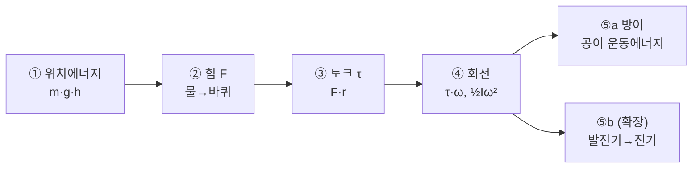

# mulle-bangah (물레방아) — water-powered rice mill

**Not a pottery wheel.** 물레방아 is a traditional Korean **water mill**: falling or flowing water turns a **wooden water wheel**, the **axle (굴통)** drives **pressing cams (눌림목)**, which rock **mill arms (방아채)** so **pestles (방앗공이)** pound grain in **stone mortars (방아확)**.

Sources: [한국민족문화대백과 — 물레방아](https://encykorea.aks.ac.kr/Article/E0019840), [삼척 물레방앗간](http://samcheok.grandculture.net/samcheok/toc/GC06700015), [울산 상수도 — 수력이용](https://water.ulsan.go.kr/water/contents/contents.do?mId=7010400).

---

## Why restart

`models/pottery-wheel/` modeled a **tabletop electric pottery wheel** (도자기 물레). That is a different machine. This project models the **folk water mill** whose name combines **물레** (water wheel) + **방아** (pounding mill).

---

## Energy chain (design north star)

Every phase should make one link in this chain inspectable in CAD / viewer / URDF.



| Step | Physics | Machine element | Phase |
|------|---------|-----------------|-------|
| ① | Gravitational PE: `E = ρ Q g h` (head pond → flume) | 보, 수로, 낙차 | B6 |
| ② | Jet force on buckets / paddles | 물줄기 → 물레바퀴 접촉 | B1 |
| ③ | Torque `τ ≈ m_bucket g r` (overshot imbalance) | 바퀴 반경, 통(bucket) | B1, B7 |
| ④ | Shaft power `P = τ ω` | 굴통 (축) | B2 |
| ⑤a | Cam lift → lever → pestle drop | 눌림목 → 방아채 → 공이 | B3–B5 |
| ⑤b | Optional generator on axle | 터빈/발전기 placeholder | B10 |

**윗걸이 vs 아랫걸이** (this project defaults to **윗걸이 / overshot** — higher efficiency, needs head):

| Type | Water entry | Energy mainly from | Typical head |
|------|-------------|-------------------|--------------|
| 윗걸이 | Top of wheel (flume) | Gravity in filling buckets | ≥ ~1.5 m |
| 아랫걸이 | Bottom stream | Flow kinetic energy | Low head, fast stream |

---

## Machine anatomy

```
        [수로 flume] ──water──►  ╭──╮
                               │  │  물레바퀴 (water wheel)
                               ╰┬─╯
                    굴통 axle ──┼── 눌림목 (cam) ──► 방아채 (lever)
                                │                      │
                                │                   공이 (pestle)
                                │                      ▼
                           (쌍방아: 축 양쪽 각 1조)  방아확 (mortar)
```

**쌍방아 (양방아):** one wheel, two cams on the axle, two mill arms — pestles alternate (like two horses on a carriage). Phase B8 targets dual-mill layout.

---

## Layout

```
models/mulle-bangah/
  README.md                 ← this plan
  src/
    lib/
      dims.py               ← B7 knobs (h, Q, wheel OD, cam radius…)
      energy.py             ← B7: τ, P, stroke rate from dims (no FEA)
    water_wheel.py          ← B0–B1
    axle.py                 ← B2
    press_cam.py            ← B3
    mill_arm.py             ← B4
    mortar.py               ← B5
    flume.py                ← B6
    mill_frame.py           ← B7 (structure)
    assembly.py             ← B8
  STEP/
  URDF/                     ← B9: wheel revolute + cam-driven pestle
  bench/                    ← timing / live-reload notes
```

---

## Phases

| Phase | Build | Delivers | Validates |
|-------|--------|----------|-----------|
| **P0** | scaffold | ✅ |
| **B0** | `water_wheel` disc | ✅ (see `_wheel_blank`) |
| **B1** | buckets + 십자목 | ✅ |
| **B2** | `axle` | ✅ |
| **B3** | `press_cam` | ✅ |
| **B4** | `mill_arm` | ✅ |
| **B5** | `mortar` | ✅ |
| **B8** | partial `assembly` | ✅ (5 parts, kinematic loop) |
| B6 | `flume` | — |
| B7 | `mill_frame` + energy | — |
| B9 | URDF | — |

### Suggested order

```
P0 → B0 → B1 → B2 → B3 → B4 → B5 → B8 (minimal loop) → B6 → B7 → B9 → B10
```

Build the **kinematic loop** (wheel → cam → pestle) before architecture (flume, house).

---

## Coordinate contract (draft)

| Datum | Frame |
|-------|--------|
| Wheel center | origin; axle along **+X** |
| Wheel plane | **YZ**; water falls **+Z** onto top rim |
| Ground / 방앗간 floor | **Z = 0** |
| Wheel axis height | **Z = WHEEL_OD/2** below flume lip (overshot) |
| Mill fulcrum | **−X** side of house; pestle over mortar **Z=0** |

Refine mates when B8 assembly is first green.

---

## Default scale (from folklore / literature)

| Parameter | Value | Note |
|-----------|-------|------|
| `WHEEL_OD` | 2200 mm | 삼척·해석 문헌 관례 |
| `WHEEL_THICK` | 400 mm | |
| `AXLE_D` | 60 mm | steel pipe |
| `HEAD_HEIGHT` | 3000 mm | tunable — drives energy estimate |
| `MILL_ARM_LEN` | 2800 mm | lever to pestle |

Full list: `src/lib/dims.py`.

---

## Build commands

```bash
npm run agents:python:setup
npm run agents:python -- models/mulle-bangah/src/assembly.py
npm run agents:cad:assembly-validate -- mulle-bangah   # validate + interfere + layout contract
```

Assembly contract: `bench/assembly-contract.md`  
Validation skill: `$cad-assembly-validate`

---

## Relationship to other folders

| Folder | What it is |
|--------|------------|
| `models/bench-pottery-wheel/` | Workspace **pipeline** benchmark (misnamed part geometry) |
| `models/pottery-wheel/` | Electric pottery wheel product attempt (wrong domain) |
| **`models/mulle-bangah/`** | **This** — traditional water mill |

Reuse **cadgen patterns** (AssemblyHelper, `drive_layout`-style datums) from bench; do **not** reuse pottery-wheel parts.

---

## Out of scope (v1)

- CFD, fluid volume mesh, actual water simulation
- Structural FEA of timber frame
- Exact wooden joinery (나무못, mortise)
- Historical reconstruction of a specific registered heritage site

---

## Next step

1. Open `models/mulle-bangah/STEP/assembly.step` in Workspace — verify wheel, cam, arm, mortar alignment.
2. Continue **B6** (flume) and **B7** (mill frame + energy printout).
3. **B8+**: second mill arm (쌍방아), then **B9** URDF.
